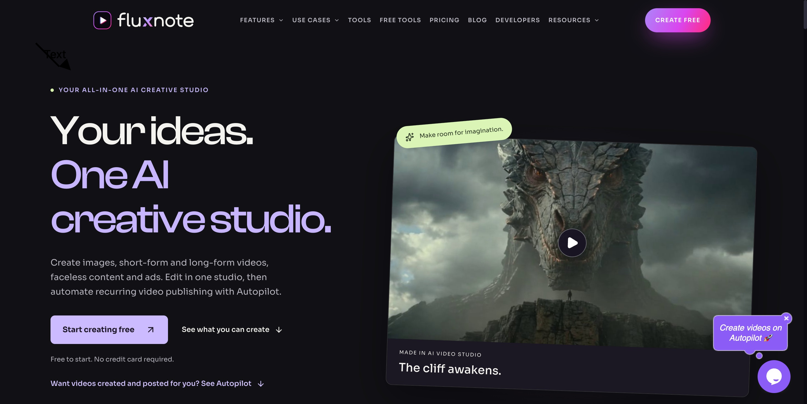
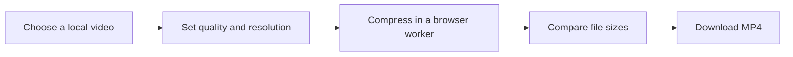

<p align="center">
  <a href="https://fluxnote.io">
    
  </a>
</p>

# Video Compressor — Frame by FluxNote

Make large videos easier to share with a free **browser-based video compressor**. Choose a quality preset, reduce the resolution, and download an **MP4**—with processing on your own device.

<a href="https://fluxnote.io">
  
</a>

<p align="center">
  <strong><a href="https://fluxnote.io">Start creating free ↗</a></strong>
  &nbsp; &nbsp; · &nbsp; &nbsp;
  <a href="#quick-start">Compress a video locally</a>
  &nbsp; &nbsp; · &nbsp; &nbsp;
  <a href="https://fluxnote.io/developers">FluxNote API documentation</a>
</p>

<p align="center">
  <strong>Follow FluxNote</strong><br /><br />
  <a href="https://www.instagram.com/fluxnote.io/" title="FluxNote on Instagram"></a>
  &nbsp;
  <a href="https://www.tiktok.com/@fluxnote" title="FluxNote on TikTok"></a>
  &nbsp;
  <a href="https://www.youtube.com/@fluxnote" title="FluxNote on YouTube"></a>
  &nbsp;
  <a href="https://x.com/fluxnote_" title="FluxNote on X"></a>
  &nbsp;
  <a href="https://www.linkedin.com/company/fluxnote" title="FluxNote on LinkedIn"></a>
</p>

**Open-source application, private video processing.** Frame’s application code is MIT licensed. Compression runs in a browser worker using FFmpeg.wasm. You don’t need a FluxNote account, an API key, a paid API, or a native FFmpeg installation. Your video is not uploaded to a compression server.

## What it does

- Accepts a video through a file picker or drag and drop.
- Offers Light, Balanced, and Strong compression presets.
- Keeps the original resolution or fits the video within a smaller size.
- Preserves aspect ratio without upscaling.
- Shows compression progress, supports cancellation, and compares input and output sizes.
- Downloads an H.264/AAC MP4 without adding a watermark.



Compression is lossy: smaller files can lose visual detail. An already compressed video may become larger; Frame reports the actual output size rather than promising a fixed reduction.

## Quick start

Requirements: **Node.js 22.13+**, **npm**, and a modern browser with WebAssembly support. An internet connection is needed to install dependencies.

Download the source and open a terminal in the project’s root directory.

### Install the app

```bash
npm ci
```

Installation copies the FFmpeg engine and worker files into `public/ffmpeg`. If your npm configuration skips installation scripts, run this once:

```bash
node scripts/copy-engine.mjs
```

### Start the compressor

```bash
npm run dev -- --port 3100
```

Open [localhost:3100](http://localhost:3100) in your browser.

### Compress your first video

1. Click **Choose video**, or drag a video into the upload area.
2. Choose **Balanced · recommended** and **Keep original** to start.
3. Click **Compress video** and keep the tab open.
4. Review the size comparison and click **Download MP4**.

The download is named after your original file, such as `holiday-compressed.mp4`. Use **Compress again** to try different settings, or remove the current video to select another. Videos are processed one at a time.

## Settings you can customize

| Setting | Options | Purpose |
| --- | --- | --- |
| Compression | Light | Preserve more detail; H.264 CRF 23 |
| Compression | Balanced (default) | Balance size and quality; CRF 28 |
| Compression | Strong | Favor a smaller file; CRF 34 |
| Resolution | Keep original (default) | Keep source dimensions, rounded down to even values if needed |
| Resolution | Fit within 1920 × 1920 | Limit the longest side to 1920 pixels |
| Resolution | Fit within 1280 × 1280 | Limit the longest side to 1280 pixels |
| Resolution | Fit within 854 × 854 | Limit the longest side to 854 pixels |

CRF controls video quality: a higher number generally produces a smaller file with more visible quality loss. Output audio uses AAC at a requested 128 kbps. Changing these settings cannot recover detail missing from the original.

For example, a 1920 × 1080 landscape video fits within the 1280-pixel bound at 1280 × 720. A 1080 × 1920 portrait video becomes 720 × 1280. Smaller videos are not enlarged.

## Supported files

**Input extensions:** MP4, MOV, AVI, MKV, WebM, FLV, MPEG, MPG, TS, VOB, and WMV.

**Output:** MP4 with H.264 video and, when present, AAC audio.

The upload limit is **800 MiB** (shown as 800 MB in the interface). An accepted extension does not guarantee that the engine can decode every codec inside that container. Empty files, unsupported extensions, and files above the limit are rejected before compression.

## How compression works

| Step | Behavior |
| --- | --- |
| Select input | Validate the file extension and size on your device |
| Prepare the engine | Load the roughly 32 MB FFmpeg engine from the app into a browser worker |
| Read the video | Copy the selected file into the engine’s in-memory filesystem |
| Encode | Apply the chosen quality and size settings to the first video track and optional first audio track |
| Save the result | Create a local download URL and show the actual file-size change |
| Clean up | Terminate the worker after completion or cancellation; release old download URLs when replaced or removed |

Engine assets are served by the app itself; no runtime CDN or external compression API is used. Additional video/audio tracks and subtitles are not retained, and metadata preservation is not guaranteed.

## Troubleshooting

| Problem | What to try |
| --- | --- |
| The engine does not load | Check that the app is running and `public/ffmpeg` exists. Run `node scripts/copy-engine.mjs` and reload. |
| Compression takes a long time | Keep the tab open. Large or high-resolution videos can take several minutes with the single-threaded engine. |
| Compression fails or the tab runs out of memory | Try a smaller input and close other memory-heavy tabs. The file picker’s limit does not guarantee enough browser memory. |
| A supported file fails to decode | Try another source or format; the file may be corrupt or contain an unsupported codec. |
| The output is larger | Try Strong compression or a lower resolution. Some source videos are already efficiently compressed. |
| Node or npm reports a version error | Verify `node --version` is at least 22.13.0, then install dependencies again. |
| Port 3100 is in use | Start with another port, for example `npm run dev -- --port 3101`. |

Input and output buffers live in memory, so available RAM matters. This browser engine is slower than native FFmpeg and is best suited to videos your device can comfortably process.

## Test without an account or private video

With dependencies installed:

```bash
npx tsc --noEmit
node scripts/test-engine.mjs
npm run build
```

The engine smoke test generates a short synthetic video with audio, compresses it, checks that the result is smaller, and decodes the output. It does not use private media or paid APIs. It validates the engine; it does not exercise the browser interface or worker integration.

## Build and run the production bundle

```bash
npm run build
npm start
```

`npm start` serves the built app locally through Wrangler; use the URL it prints. It does not publish the app. Frame uses React, TypeScript, Tailwind CSS, and the Sites Vinext scaffold.

### Package the source download

Requires Python 3:

```bash
python3 scripts/package-source.py
```

This refreshes `public/source.zip`, linked from the app’s open-source section. The archive includes application code, documentation, branding assets, and the dependency lockfile. Installed packages, engine binaries, generated builds, credentials, and local runtime state are excluded. Run `npm ci` after extracting it to restore dependencies and engine assets.

## Build something useful

Start with a short clip and compare the presets to find a size and quality that works for your workflow. Contributions can improve format handling, accessibility, memory use, or compression controls. Include a clear reproduction and relevant checks with changes.

Explore [FluxNote](https://fluxnote.io) for AI image and video creation, or use the [FluxNote developer documentation](https://fluxnote.io/developers) for generation integrations.

**Have a story to make? [Create with FluxNote →](https://fluxnote.io)**

## License and support

[MIT](LICENSE) covers Frame’s application code. FluxNote branding and trademarks belong to their respective owners. Third-party components retain their own licenses: the FFmpeg.wasm wrapper is MIT licensed, while the bundled FFmpeg core includes GPL components such as x264. See [THIRD_PARTY.md](THIRD_PARTY.md) for engine notices and source references before redistributing a built app.

For compressor bugs, open an issue in the repository where you obtained this source. Include your OS, browser and Node.js versions, input format, selected settings, and a minimal reproduction using a non-sensitive sample. Do not attach credentials or private videos. For FluxNote account or billing help, contact [support@fluxnote.io](mailto:support@fluxnote.io).
